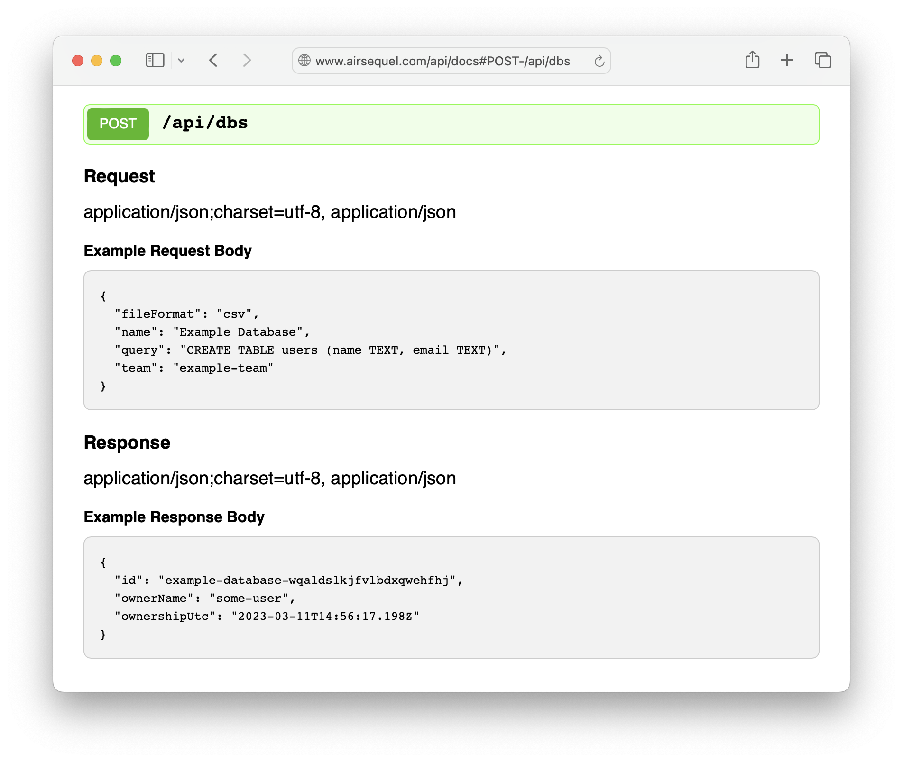

# Servant Docs Blaze

Create an HTML documentation page for your Servant API
via [Servant Docs](https://hackage.haskell.org/package/servant-docs)
and [Blaze HTML](https://hackage.haskell.org/package/blaze-html).

This repo is necessary, because Servant.Docs only includes a
[markdown renderer] per default.

[markdown renderer]:
  https://hackage.haskell.org/package/servant-docs-0.13/docs/Servant-Docs.html#v:markdown

> [!WARNING]
> This hasn't been written in a way that it can be used as a library, yet.
> Any help to make this possible and release it on Hackage is appreciated!
> Until then, you can copy the code into your project
> and manually adapt it to your needs.
